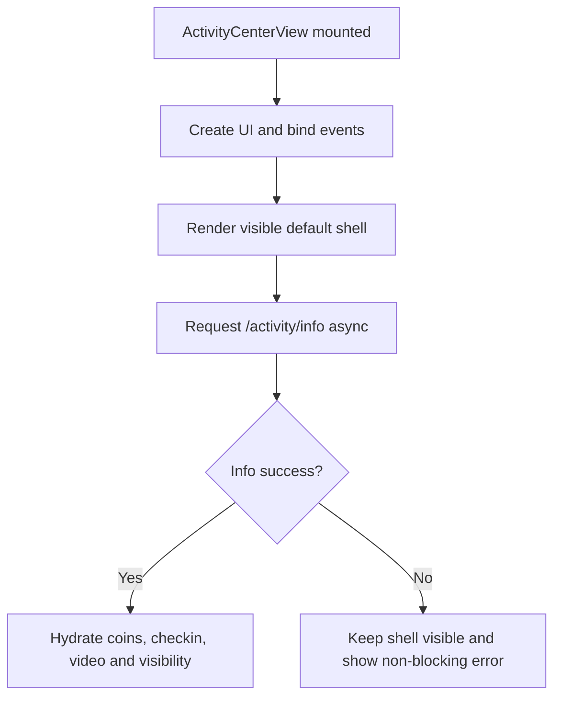
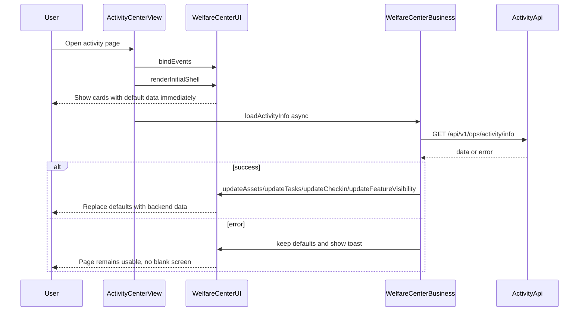

# Activity Center 首屏先渲染设计

## Problem Statement

用户点击进入活动平台页面后，会看到页面空白约五六秒，之后内容才显示。结合当前代码，问题不是前端静态资源必然很慢，而是 Activity Center 的核心 section 初始都被 `display:none` 隐藏，只有 `/api/v1/ops/activity/info` 返回后才根据任务存在与否显示。

当前模板中核心区域默认隐藏：

```31:32:src/views/ActivityCenterView.vue
<section id="tc-checkin-section" class="tc-section" style="display:none;">
  <div class="tc-card tc-balance-card">
```

```51:52:src/views/ActivityCenterView.vue
<section id="tc-video-task-section" class="tc-section" style="display:none;">
  <div class="tc-card tc-flow-card">
```

```81:82:src/views/ActivityCenterView.vue
<section id="tc-daily-checkin-section" class="tc-section" style="display:none;">
  <div class="tc-card tc-checkin-card">
```

```128:130:src/views/ActivityCenterView.vue
<section id="tc-lucky-spin-section" class="tc-section" style="display:none;">
  <h2 class="tc-section-title">Tasks for You</h2>
  <div class="tc-card tc-video-card">
```

初始化阶段又主动隐藏所有任务区域：

```398:406:src/boot/initActivityCenter.js
ui.bindEvents();
// Hide optional task sections until /activity/info confirms they exist in tasks[].
ui.updateFeatureVisibility({ checkin: false, video: false });
logger.log("[Activity UI Guard] tasks sections hidden by default");
ui.updateAssets(business.getUserAssets());
ui.updateTasks({ watchAd: null });
ui.updateCheckin(null);

business.loadActivityInfo(apiOptions);
```

这会导致 `/activity/info` 慢时首屏没有主内容可见。

## Goals

- 页面进入后立即展示可用的静态骨架和默认数据，不等待后端接口。
- `/activity/info` 返回后再动态刷新金币、签到、视频任务、转盘奖池和可见性。
- 保持现有接口、SDK、路由、广告逻辑不变。
- 后端失败时页面仍显示基础内容，并通过 toast 或默认状态提示用户可重试。

## Non-Goals

- 不改 Native SDK。
- 不改 `/api/v1/ops/activity/info` 接口结构。
- 不引入全局状态库或新的 UI 框架。
- 不把所有任务强行永久展示；接口返回后仍应按后端任务配置修正可见性。

## Constraints

- 当前页面是 Vue 模板 + DOM UI 控制层混合实现，主要文件是 `src/views/ActivityCenterView.vue`、`src/boot/initActivityCenter.js`、`src/lib/activity-center-ui.js` 和 `src/lib/activity-center-business.js`。
- `WelfareCenterBusiness.loadActivityInfo()` 已经能在成功时动态更新资产、任务、签到和 feature visibility。
- 现有 `updateTasks({ watchAd: null })` 会隐藏视频和转盘区域，不适合作为首屏默认状态。
- 需要避免显示错误的“已完成”或“可领取”状态；默认值应是保守的 0、未签到、可点击但由实际操作再校验。

## Architecture



## End-to-End Runtime Flow



## Files To Modify

- `src/views/ActivityCenterView.vue`
  - Remove inline `display:none` from above-the-fold sections that should be visible immediately.
  - Keep modals and overlays hidden.
  - Preserve existing placeholder data such as `0 Gold Coins`, `0 Spins`, and 7-day check-in placeholder.

- `src/boot/initActivityCenter.js`
  - Replace the current initial hiding guard with a first-render shell call.
  - Do not call `ui.updateTasks({ watchAd: null })` during initial render because it hides video sections.
  - Start `business.loadActivityInfo(apiOptions)` asynchronously after shell render.

- `src/lib/activity-center-ui.js`
  - Add a small `renderInitialShell()` or `showInitialShell()` method.
  - The method should show balance, flow intro, daily check-in, and lucky spin sections with safe default values.
  - Keep existing `updateFeatureVisibility()` behavior for the real backend response.
  - Optionally add a lightweight loading class/text if needed, but avoid skeleton complexity.

- `src/lib/activity-center-business.js`
  - Optionally adjust `loadActivityInfo()` failure branch to trigger a non-blocking toast instead of leaving the page silently stale.
  - Do not change successful data parsing behavior.

## Core Code Changes

Add a UI method similar to:

```javascript
renderInitialShell() {
  this.updateFeatureVisibility({ checkin: true, video: true });
  this.updateAssets({ goldCoins: 0 });
  this.renderTurntableFromCoins(this.spinPrizePool);
  this.refreshAdTaskStats();
}
```

Then initialization becomes:

```javascript
ui.bindEvents();
ui.renderInitialShell();
business.loadActivityInfo(apiOptions);
```

The backend response still owns the final truth:

```javascript
if (!this._featuresInitialized) {
  this._featuresInitialized = true;
  this.config.onFeatureVisibilityUpdate({
    checkin: hasCheckinTask,
    video: hasVideoTask,
  });
}
```

## Step-by-Step Execution Path

Step 1. Remove inline `display:none` from the main Activity Center sections in `src/views/ActivityCenterView.vue`.

Step 2. Add `renderInitialShell()` to `src/lib/activity-center-ui.js`, showing safe default content immediately.

Step 3. Update `src/boot/initActivityCenter.js` to call `ui.renderInitialShell()` instead of hiding all task sections on startup.

Step 4. Keep `business.loadActivityInfo(apiOptions)` asynchronous and let it hydrate real data when the API returns.

Step 5. Verify that API failure leaves visible default content rather than a blank page.

Step 6. Run lint diagnostics and production build.

## Testing And Acceptance Criteria

- With a slow `/activity/info` response, the user sees the Activity Center shell immediately.
- Static sections show default values such as `0 Gold Coins`, `0 Spins`, and check-in placeholders before data arrives.
- When `/activity/info` succeeds, real balance, check-in, video task, spin stats, and feature visibility replace defaults.
- If the backend omits a task type, the related section is hidden after the first successful response.
- If `/activity/info` fails, the page does not go blank.
- Modals and overlays remain hidden until user interaction.
- `npm run build` succeeds.

## Risks And Rollback Plan

Risk: A section may briefly appear and then disappear if the backend says that task is unavailable. This is preferable to a long blank screen, but the flash should be minimized by keeping default content neutral.

Risk: Showing Lucky Spin before backend data returns could let a user tap quickly. Existing click handlers still rely on current task status and ad checks; if needed, the initial shell can disable action buttons until hydration.

Rollback: Revert `renderInitialShell()` usage and restore startup `updateFeatureVisibility({ checkin:false, video:false })`. This returns to the current blank-until-data behavior.
